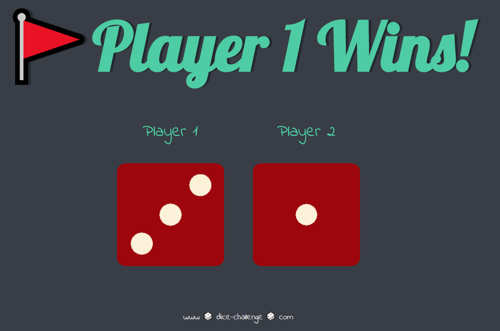
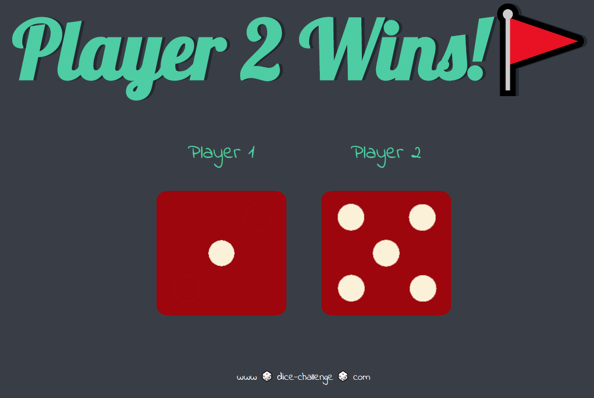
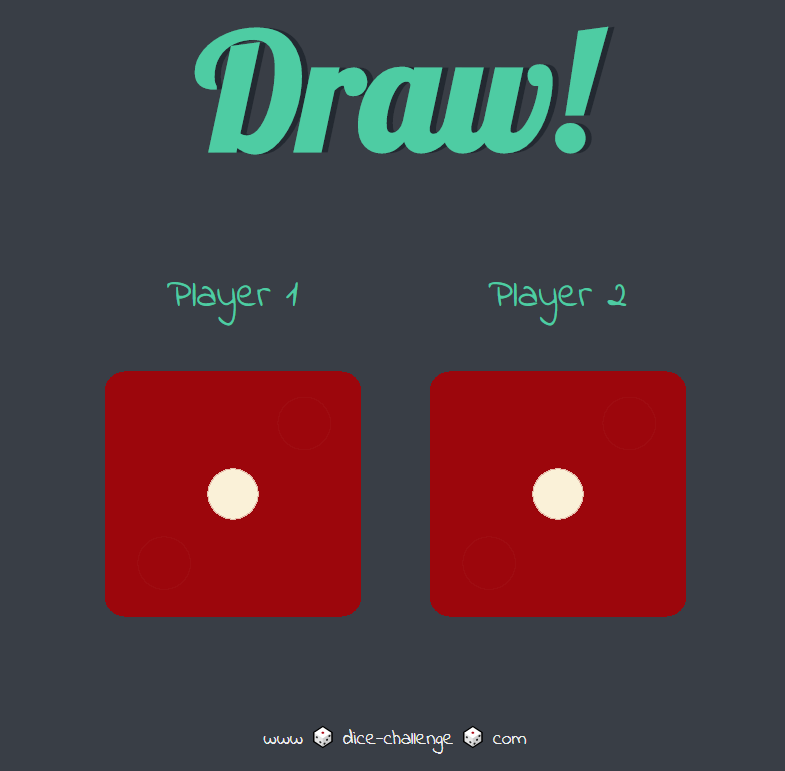

# dice-game
A simple dice game created using HTML, CSS and JS

# Idea
1. To create and build a simple game using JavaScript
2. Used simple query selectors, math function and random function in JavaScript to implement the game.

# How to Play
1. Press the refresh button (F5) to refresh the page.
2. If the number on the dice of player 1 is greater than the number on the dice of player 2, then player 1 wins
3. If the number on the dice of player 1 is less than the number on the dice of player 2, then player 2 wins
4. If the number on the dice of player 1 is equal to the number on the dice of player 2, then it is a draw

# Screenshots

